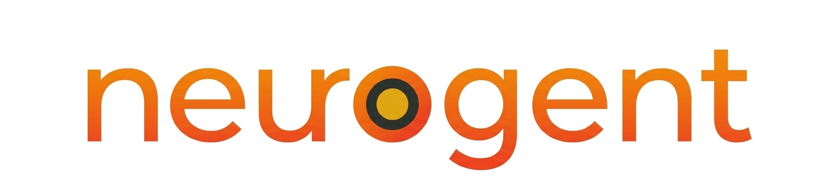

<div align="center">



<br/>
<br/>

# Neurogent

### A team of AI experts in your terminal. One command to start.

<br/>

[](https://www.npmjs.com/package/@praesidia/neurogent)
[](https://www.npmjs.com/package/@praesidia/neurogent)
[](LICENSE)
[](https://www.typescriptlang.org/)
[](CONTRIBUTING.md)

<br/>

[**Quickstart →**](#quickstart) · [Shell](#shell) · [Build an agent](#build-an-agent) · [A2A Protocol](#a2a-protocol) · [Contributing](#contributing)

<br/>


</div>

---

**Neurogent** is two things in one package:

**1. A multi-agent terminal shell** — spin up a full team of AI specialists, address them individually, chain them together, or broadcast to all at once. No backend. No UI. Just a key and a command.

**2. An open agent framework** — define an agent in YAML, add tools, ship to production with a single command. Any model. Full streaming. A2A-compliant out of the box.

---

## Quickstart

```bash
npm install -g @praesidia/neurogent

export ANTHROPIC_API_KEY=sk-ant-...   # or OPENAI_API_KEY=sk-...

neurogent-shell --config examples/dev-trio.yaml
```

Three AI specialists, ready in seconds:

```
> @engineer write a rate limiter middleware for Express

⚡ Engineer   Here's a sliding-window rate limiter with Redis...

> @security audit that

🛡 Security   Three concerns. The token bucket has a race condition on...

> @engineer >> @security    ← chain agents — engineer writes, security reviews automatically
```

---

## Shell

### Built-in packs

Pick a team or build your own in minutes with a YAML file.

#### `dev-trio` — Lean engineering team

```bash
neurogent-shell --config examples/dev-trio.yaml
```

| Agent | Role | What they bring |
|---|---|---|
| ⚡ **Engineer** | Full-Stack | Clean, production-ready code. Diplomatically brutal in reviews. |
| 🛡 **Security** | AppSec | Ex-red-team mindset. Flags exact CVEs, exact vectors, exact fixes. |
| 🔍 **Reviewer** | Code Review | Prioritizes must-fix over nice-to-have. Specific and direct. |

#### `full-team` — 10-agent engineering org

```bash
neurogent-shell --config examples/full-team.yaml
```

| Agent | Role | What they bring |
|---|---|---|
| ⚡ **Nova** | Coder | Architecture-first. Thinks TypeScript types are beautiful. |
| ☁️ **Atlas** | Cloud | Ex-SRE. Thinks in blast radii and runbooks. Unnervingly calm. |
| 🔬 **Kai** | Researcher | Constitutionally incapable of a shallow answer. |
| ✍️ **Luna** | Writer | Cuts ruthlessly. Opening line is never an afterthought. |
| 🛡️ **Orion** | Security | Thinks like an attacker. Never sugarcoats risk. |
| 📊 **Sage** | Data | Trusts nothing until they've checked data quality. SQL-native. |
| 🌿 **Ivy** | Marketing | Growth-obsessed. Creativity and analytics are the same muscle. |
| 🔧 **Rex** | DevOps | Automate everything, then monitor it. Bash one-liners are a love language. |
| 📋 **Leo** | Product | Zero tolerance for scope creep. User outcomes, not feature outputs. |
| 💬 **Mia** | Support | Confusion is a product failure, not a user failure. |

#### `marketing-team` — 10-agent marketing org

```bash
neurogent-shell --config examples/marketing-team.yaml
```

Brand, Content, SEO, Social, Growth, Email, Ads, Analytics, PR, and Product Marketing — all in one session.

#### `solo-researcher` — Single deep analyst

```bash
neurogent-shell --config examples/solo-researcher.yaml
```

#### Build your own team in 30 seconds

```yaml
# my-team.yaml
shell:
  name: "My Team"

model:
  provider: anthropic
  name: claude-3-5-sonnet-20241022

agents:
  - id: alice
    name: Alice
    role: Backend Engineer
    emoji: "⚡"
    color: cyan
    expertise: [code, api, database, typescript, node]
    system_prompt: |
      You are Alice, a senior backend engineer obsessed with clean APIs
      and bulletproof data models. You write TypeScript like poetry.
```

```bash
neurogent-shell --config my-team.yaml
```

### Shell commands

```
@agent <message>           Address a specific agent
@agent1 >> @agent2         Chain — first responds, output goes to second
/swarm                     All agents respond to your next message
/agents                    List agents with roles and expertise
/export                    Save conversation to markdown
/clear                     Clear the feed
/help                      Show all commands
ESC                        Quit
```

---

## Build an agent

Define an agent in YAML. Add tools. Ship to production.

### 1. Scaffold

```bash
neurogent init my-agent && cd my-agent
```

### 2. Define

```yaml
# neurogent.yaml
name: Research Agent
version: 1.0.0
description: Deep research on any topic.
author: You
license: MIT

capabilities: [web-search, summarization]

model:
  provider: anthropic          # swap to openai — zero code changes
  name: claude-3-5-sonnet-20241022

memory:
  type: conversation-buffer
  max_messages: 50
```

### 3. Add tools

```typescript
// src/index.ts
import { createAgent, Tool } from '@praesidia/neurogent';
import { z } from 'zod';

const agent = createAgent({
  config: './neurogent.yaml',
  systemPrompt: 'You are a world-class research analyst.',
  tools: [
    new Tool({
      name: 'fetch-url',
      description: 'Fetch and read content from a URL',
      schema: z.object({ url: z.string().url() }),
      execute: async ({ url }) => {
        const res = await fetch(url);
        return res.text();
      },
    }),
  ],
});

agent.start(8080);
```

### 4. Run locally

```bash
export ANTHROPIC_API_KEY=sk-ant-...
neurogent dev
```

Your agent is live at `http://localhost:8080`:

```bash
# Discover capabilities
curl http://localhost:8080/.well-known/agent.json

# Send a task (streaming)
curl -X POST http://localhost:8080/a2a/message \
  -H "Content-Type: application/json" \
  -d '{"stream": true, "message": {"role": "user", "content": "Research Stripe pricing"}}'

# Track task status
curl http://localhost:8080/a2a/tasks/<taskId>
```

### 5. Ship

```bash
neurogent build            # → dist/.well-known/agent.json
neurogent deploy --compose # → Dockerfile + docker-compose.yml

docker compose up --build
```

---

## A2A Protocol

Every Neurogent agent exposes the [A2A](https://a2a.dev) standard interface — agents can discover and call each other across the network without custom integration code.

| Endpoint | Description |
|---|---|
| `GET /.well-known/agent.json` | AgentCard — name, capabilities, tools |
| `POST /a2a/message` | Send a task (`"stream": true` for SSE streaming) |
| `GET /a2a/tasks/:id` | Poll status: `PENDING → WORKING → COMPLETED` |
| `POST /a2a/tasks/:id/cancel` | Cancel an in-flight task |

### Agent-to-agent calls

```yaml
# neurogent.yaml
sub_agents:
  - name: researcher
    description: Gathers raw information
    endpoint: http://localhost:8081
```

```typescript
const data = await ctx.delegate('researcher', 'Analyze Stripe pricing model');
```

---

## Security

Add policy enforcement without changing your agent code:

```typescript
import { PraesidiaHooks } from '@praesidia/neurogent/security';

createAgent({
  config: './neurogent.yaml',
  hooks: [PraesidiaHooks.withPolicy('./policy.yaml')],
});
```

```yaml
# policy.yaml
schema_version: 1.0
enforcement: strict
rules:
  ingress:
    - rule: block_jailbreak
      action: reject
  egress:
    - rule: redact_pii
      types: [EMAIL, CREDIT_CARD, SSN]
      action: modify
  tools:
    - match: send_email
      require_human_approval: true
```

`PraesidiaHooks` implements the open `AgentHook` interface — write your own security layer by implementing the same interface.

---

## Why Neurogent?

| | LangChain / CrewAI | Neurogent |
|---|---|---|
| **Focus** | How your agent *thinks* | How your agent *runs and communicates* |
| **Config** | Python code | One YAML file |
| **Multi-agent** | Orchestration graphs | Terminal shell + A2A protocol |
| **Production** | You figure it out | `neurogent deploy` → Dockerfile |
| **Discovery** | None | `neurogent register` → A2A directory |
| **Model switch** | Rewrite imports | Change one line in YAML |
| **Security** | DIY | Built-in policy hooks |

LangChain and CrewAI are great at orchestrating *how agents think*. Neurogent handles *how they run, communicate, and get deployed*. They work great together.

---

## Contributing

Neurogent is MIT-licensed and built in public. Every contribution matters — whether it's a new agent pack, a provider adapter, a bug fix, or a typo.

### Get started

```bash
git clone https://github.com/praesidia/neurogent
cd neurogent && npm install
npm run build
npm test
```

### Good first issues

| Area | What to build |
|---|---|
| **Provider adapters** | Add Gemini, Mistral, Groq, or Ollama support |
| **Agent packs** | Legal team, design team, data science team, finance team |
| **MCP integrations** | Connect popular MCP servers (filesystem, browser, databases) |
| **Shell features** | Session history, agent pinning, keyboard shortcuts |
| **A2A extensions** | Agent discovery registry, auth improvements |
| **Documentation** | Guides, tutorials, translated docs |
| **Tests** | Unit and integration test coverage |

### How to contribute

1. **Fork** the repo and create a branch: `git checkout -b feat/my-feature`
2. **Make your changes** — keep PRs focused and small
3. **Add tests** if you're adding new functionality
4. **Open a PR** with a clear description of what and why
5. **Join the discussion** — we review all PRs within 48 hours

### Building a new agent pack

The fastest way to contribute. Copy an existing example:

```bash
cp examples/dev-trio.yaml examples/my-team.yaml
# edit agents, system prompts, expertise keywords
# open a PR — we'll add it to the built-in packs
```

### Reporting bugs

Open an issue with:
- What you ran (command + config)
- What you expected
- What happened
- Node version + OS

---

## Roadmap

- [ ] Web UI dashboard for agent sessions
- [ ] Agent marketplace — share and discover packs
- [ ] Persistent memory across sessions
- [ ] Multi-modal agents (vision, audio)
- [ ] Native MCP server integrations
- [ ] VS Code extension

Star the repo to follow along. PRs welcome on any of the above.

---

<div align="center">

**MIT License · Free forever · Built in public**

<br/>

If Neurogent saves you time, the best thing you can do is ⭐ star the repo and tell a friend.

<br/>

<sub>Enterprise security and compliance · <code>import { PraesidiaHooks } from '@praesidia/neurogent/security'</code></sub>

</div>
